# VoxelQR

**Turn any link, network, contact or message into a living 3D voxel sculpture
that transforms into a QR code.**

By **Lewis John Villamor**


VoxelQR renders a link as a voxel sculpture with three small voxel plots
resting around it — the finder squares, grounded in scenery built from the same
palette. No platform, no visible code.

Seven sculptures ship: a floating cube, a crystal, a gift box, a downtown city
skyline, an island with a tree, an abstract portal, and an LV monogram. Press the
sculpture and the camera tilts to a perfect top-down view while the code grows
out of the ground and the sculpture is absorbed into it. Press the code and the
same timeline runs backwards — one surface, one gesture, both directions.

A code can carry a **link, plain text, a Wi-Fi network, a contact card, an
email, an SMS or a phone number**. Upload a picture and it becomes the sculpture
itself. Its modules and its corner rings can be
**square, semi-round, round or dots** — and the shape applies to the voxels and
to the finished code alike, so choosing one changes what you watch as well as
what you scan. A **logo** can sit in the middle. All of it lives in the settings
drawer, top right.

Everything happens in the browser. There is no backend, no database, no account,
and what the code carries is never sent anywhere.

## The transformation

| Sculpture                                                 | Mid-reveal                                                              | Scan-ready                                                    |
| --------------------------------------------------------- | ----------------------------------------------------------------------- | ------------------------------------------------------------- |
|  |  |  |

The scan-ready image above is a real, working code — it decodes to
`https://voxelqr.example/hello`, and the test suite decodes that exact file.

## Sculptures and themes

|                                                                 |                                                                      |                                                                           |
| --------------------------------------------------------------- | -------------------------------------------------------------------- | ------------------------------------------------------------------------- |
|  |         |                |
| **Island** · Nature                                             | **Big city** · Cyber                                                 | **Crystal** · Crystal                                                     |
|  |  | 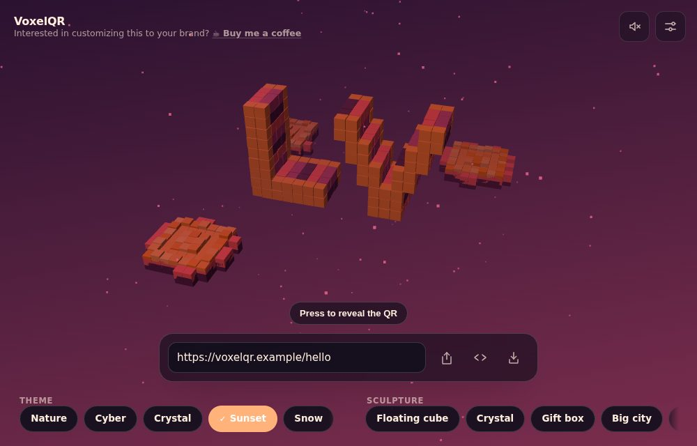 |
| **Gift box** · Sunset                                           | **Abstract portal** · Snow                                           | **Brand** · Sunset                                                        |

Every layout is seeded from what the code encodes, so the same input always
produces the same sculpture.

## What a code can be, and what it can look like

The settings drawer opens from the gear in the top right. It holds what the
code carries, the shape of its modules and finder rings, and the logo.

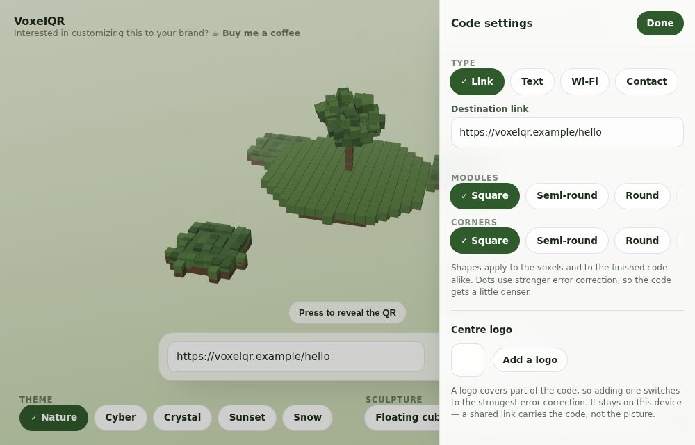

| Type        | What a phone does with it        |
| ----------- | -------------------------------- |
| **Link**    | Opens a web address              |
| **Text**    | Shows a plain message            |
| **Wi-Fi**   | Joins the network                |
| **Contact** | Saves a contact card (vCard 3.0) |
| **Email**   | Opens a pre-filled message       |
| **SMS**     | Opens a pre-filled text          |
| **Phone**   | Starts a call                    |

Modules and finder rings can each be square, semi-round, round or dots — and
the shape applies to the voxels and to the finished code alike, so choosing one
changes what you watch as well as what you scan.

| Square                                                     | Semi-round                                                   |
| ---------------------------------------------------------- | ------------------------------------------------------------ |
| 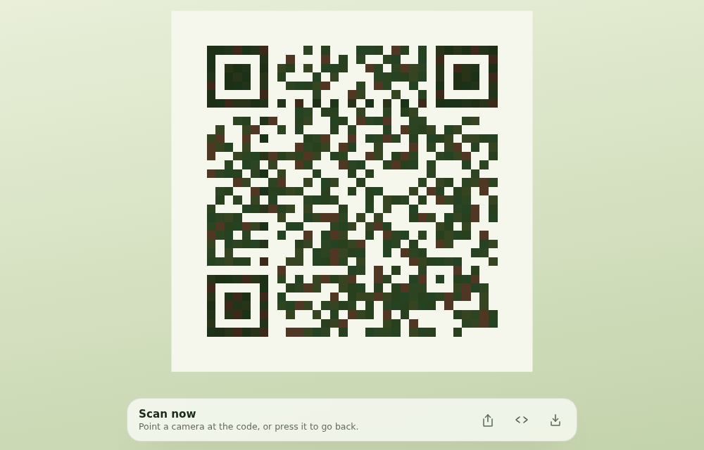 | 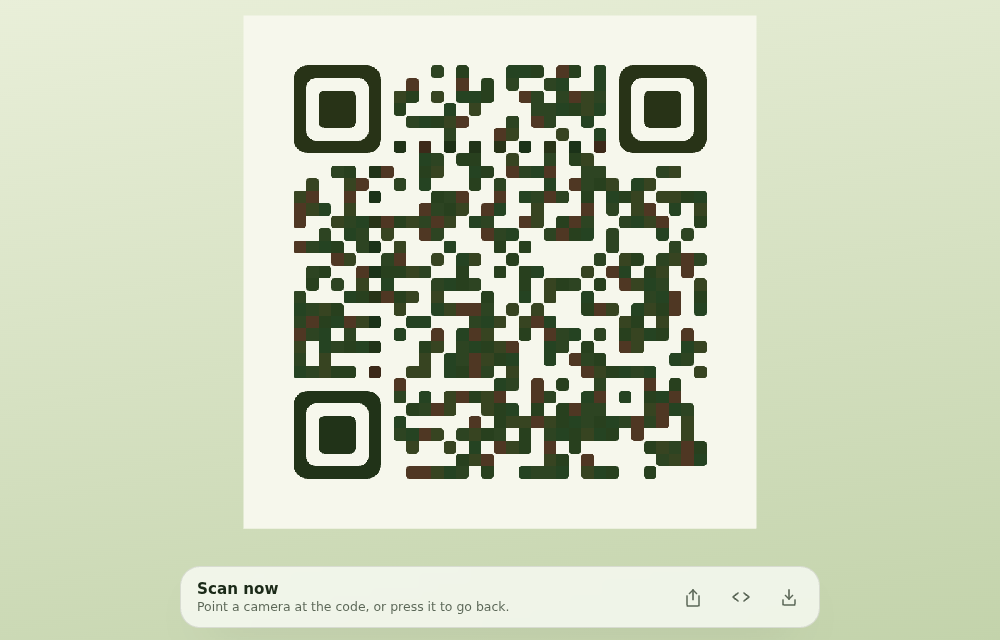 |

| Round                                                    | Dots                                                           |
| -------------------------------------------------------- | -------------------------------------------------------------- |
| 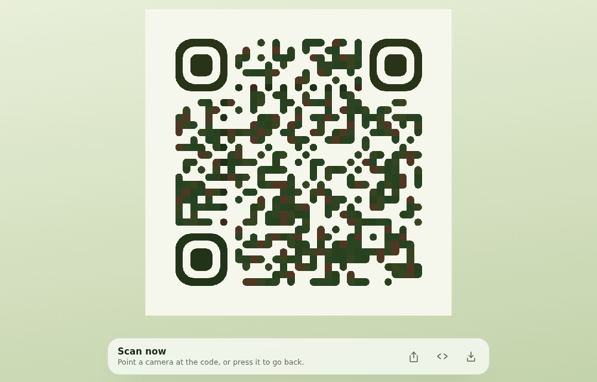 | 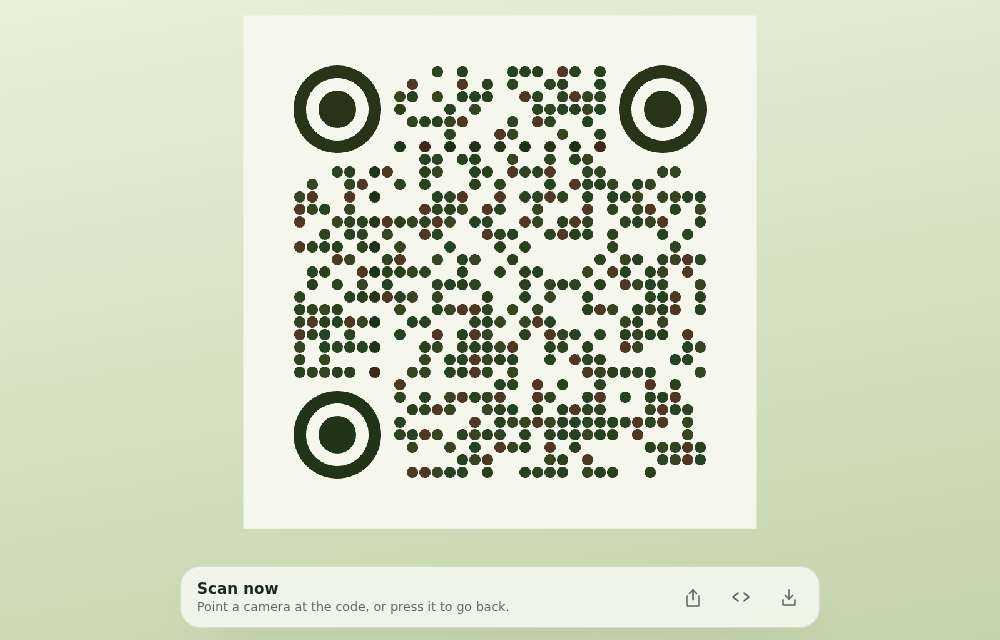 |

### Your own sculpture, from a picture

Upload a flat image and it becomes the object standing on the code — background
dropped, what is left extruded into a solid, keeping its own colours rather than
the theme's. It is absorbed by the reveal exactly like a built-in sculpture.

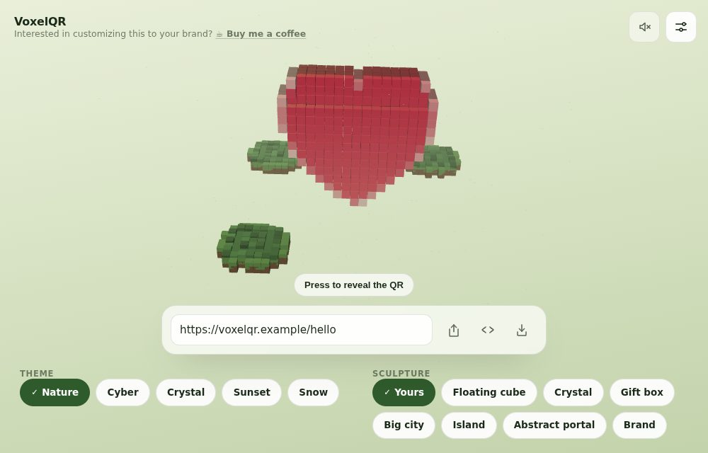

The interesting part is not putting a cube where each pixel is — that gives a
flat card with a brick where the background used to be. It is deciding which
pixels are the subject, and how to split a fixed cube budget between resolution
and depth:

- **The background is found by counting the border, not averaging it.** A logo
  cropped to its own bounding box runs off the frame, and an average is dragged
  into no-man's-land by those pixels, matches nothing, and hands back the whole
  picture as a slab. Counting means the subject has to _outnumber_ the
  background around the edge before detection gives up — and a photograph that
  runs edge to edge correctly keeps every pixel, because there is no background
  to remove.
- **Some of the budget buys depth.** Spending it all on resolution gives a
  picture one cube thick: seen from the side it is a line, and the reveal turns
  the sculpture before it comes apart. A coarser grid that is genuinely solid
  reads as an object.
- **The cube budget is the device's own.** A picture costs a weak phone no more
  than a built-in sculpture does.

Like the logo, the picture stays on the device that chose it — a shared link
falls back to a built-in sculpture rather than opening on nothing.

### Centre logo

A logo can sit in the middle. Adding one switches to the strongest error
correction, and the covered area is capped at roughly 5% of the code:

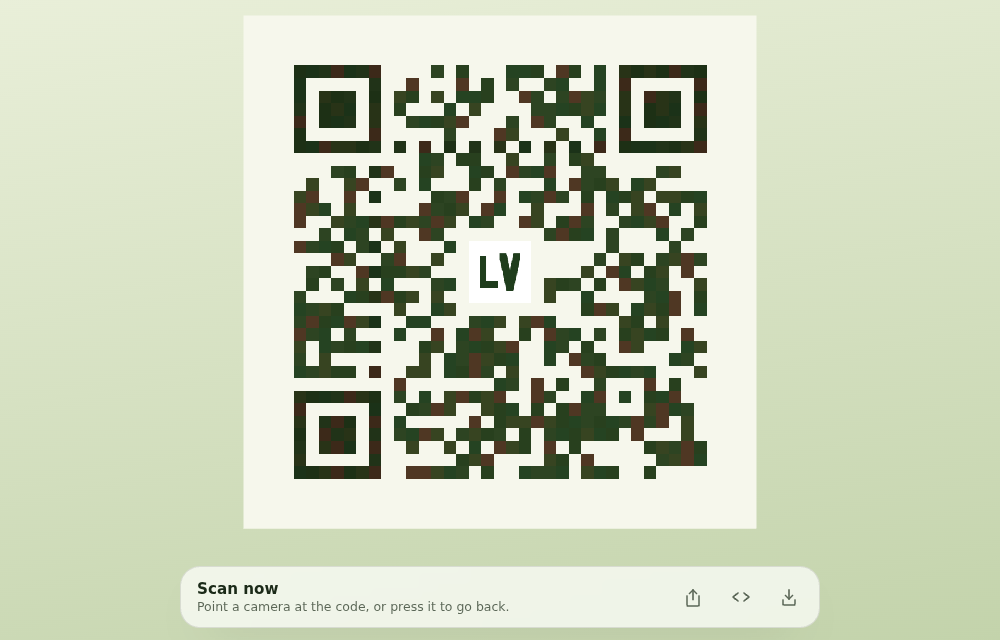

All five of those are real, working codes. They decode to
`https://voxelqr.example/hello`, and they are captured from the running app by
the same Playwright harness that decodes them — the logo in the last one is the
same picture the logo decode test uses, so the README cannot show a code nobody
verified.

## Anywhere it needs to go

| Embeddable widget                                        | On a phone                                  |
| -------------------------------------------------------- | ------------------------------------------- |
|  |  |

---

## Quick start

```bash
npm install
npm run dev        # http://localhost:5173
```

| Script                            | What it does                                            |
| --------------------------------- | ------------------------------------------------------- |
| `npm run dev`                     | Dev server with the production CSP applied              |
| `npm run build`                   | Typecheck and build to `dist/`                          |
| `npm run preview`                 | Serve `dist/` on port 4173                              |
| `npm test`                        | Unit and component tests (Vitest)                       |
| `npm run test:e2e`                | Browser tests, including the ZXing decode matrix        |
| `npm run media`                   | Regenerate the README screenshots from the running app  |
| `npm run lint` / `npm run format` | ESLint / Prettier                                       |
| `npm run verify`                  | Format check, lint, unit tests and build — what CI runs |

The end-to-end suite builds nothing itself; run `npm run build` first, or let the
Playwright web server do it via `npm run preview`.

---

## How it works

```
React UI  ──►  experience store (validated state)
                 │
                 ├──►  src/qr/        payloads (link, Wi-Fi, vCard, …) → encoded string
                 │                    build-matrix (error-correction floor) → generate-matrix
                 │                    shapes (one vocabulary, two renderers) + logo
                 ├──►  src/sharing/   zod schema → base64url codec (?experience=)
                 └──►  src/themes/    palette + contrast guarantee
                          │
              src/voxel/  build-qr-layout + build-sculpture-layout → VoxelInstance[]
                          module-geometry: the same shape, as geometry
                          image-to-voxels: an uploaded picture, as a solid
                          │
          src/animation/  one reversible master timeline → progress 0..1
                          │
   src/components/scene/  InstancedMesh per shape + scan-safe backing plane
```

Each module owns one thing. The QR engine does not know what a voxel is; the
scene renders but never holds application state; the timeline animates but never
validates a URL. `src/qr/shapes.ts` is the clearest case: it is a vocabulary and
nothing else, so neither renderer owns the other — the canvas turns a shape into
a path and `src/voxel/module-geometry.ts` turns the same shape into geometry. Nothing calls `setState` during the animation loop — the frame
loop writes matrices into a single `InstancedMesh`.

### Why the code actually scans

Rendering a QR out of cubes is the entire product and the entire risk, so
reliability is enforced in three places rather than hoped for:

1. **Exact lock geometry.** At the end of the timeline the camera looks straight
   down −Z, the QR plane sits frontally at z = 0, rotations are zero and module
   spacing is exactly one world unit. A frontal flat plane under a perspective
   camera has no projection error.
2. **A canonical backing layer.** A nearest-filtered `CanvasTexture` carrying the
   mathematically exact code — quiet zone included — sits just behind the voxels
   in the same colours, so anti-aliased cube edges land on correct pixels.
3. **A shader-level flat lock.** At the lock stage the lit result is replaced by
   the raw instance colour, so lighting, fog and shadows cannot tint a module.

On top of that, `toScanSafePair` guarantees at least a 7:1 contrast ratio with
the darker colour as the foreground, for every theme.

And it is a build gate: `tests/e2e/qr-decode.spec.ts` screenshots the live WebGL
canvas in its scan-ready state and decodes it with ZXing across six viewports and
pixel densities, every theme, every sculpture, short and long URLs, and
reduced-motion mode. `tests/e2e/shapes-decode.spec.ts` does the same for every
module shape, every corner shape, the softest combination of the two, and every
payload kind; `tests/e2e/logo-decode.spec.ts` covers a code with a logo in it. A
code that will not decode fails CI.

Those matrices are driven from the product's own lists, so a new shape or a new
payload kind cannot ship without a decode test covering it — and they earn their
keep. The first run found that dotted modules were being drawn over the finder
rings, which destroys the 1:1:3:1:1 ratio a detector scans for: the code stopped
decoding entirely while still looking, to the eye, like a perfectly good QR.

### Shapes and logos, and what they cost

Both are ways of throwing dark area away, so both are paid for in error
correction rather than hoped for:

- **Round and semi-round** round only the corners a module does _not_ share with
  a dark neighbour, so a run of modules stays one solid bar — the thing a
  decoder actually samples. They cost nothing in redundancy.
- **Dots** detach every module, so a dotted code is pinned to level `Q` and
  never steps down the ladder for size.
- **A logo** pins the code to level `H` — 30% recovery — against a covered area
  capped at roughly 5%, quiet pad included. It is drawn into the canonical
  texture rather than added to the scene, so the scan surface stays a single
  exact image and the voxel morph is untouched: the tiles grow, swell and shrink
  away exactly as before, and the logo arrives with the plane they hand the code
  over to.
- **Finder rings** are drawn whole — as one shape rather than 33 modules —
  whenever anything is shaped, whatever the corner shape is set to. That is what
  keeps the detection ratio exact at every radius, including the circle.

### Scanning headroom, measured

"It decodes" is a weak test — it says nothing about how much room the code has
before it stops working. `tests/e2e/degrade.ts` shrinks a capture and re-decodes
it, which stands in for scanning from further away or with a poorer sensor, and
reports the smallest fraction that still reads.

That measurement changed the design. Error correction was fixed at level `H`,
following the spec's advice — but `H` is protection against a code being
_obscured_, and nothing obscures this one: the sculpture is fully absorbed and
the scan plane is clean. What actually limits scanning is how many screen pixels
each module gets, and `H` was spending 30% more modules to buy redundancy the
design never needed:

| Link      |  Level `H` |         Adaptive |  Headroom before | Headroom after |
| --------- | ---------: | ---------------: | ---------------: | -------------: |
| 29 chars  | 33 modules | 33 modules (`H`) |   decodes at 10% | decodes at 10% |
| 72 chars  | 49 modules | 41 modules (`Q`) |                — |              — |
| 173 chars | 69 modules | 53 modules (`M`) | **only at 100%** | decodes at 15% |

`chooseErrorCorrectionLevel` now takes the strongest level whose code still fits
a module budget, never dropping below `M` (15% recovery, the usual print
default). Short links keep `H` and lose nothing; the long link gained roughly
6.7x more scanning distance. `tests/e2e/scan-margin.spec.ts` locks that in — pin
the level back to `H` and it fails.

The same measurement drove two more decisions. The mosaic's contrast floors were
raised from 5:1 and 6.5:1 to **7:1 and 9:1** — 5:1 is comfortable for text and
thin for a QR module, and a lightly-tinted module on a glare-lit screen is
exactly the one a binarizer misreads. And the 2D fallback drops the mosaic
entirely for the solid contrast-guaranteed pair (**15:1 or better** on every
theme): it renders where WebGL could not, on the weakest devices and often the
poorest screens, so decoration is the wrong trade. It decodes down to 25% of
capture size, guarded by its own test.

---

## Sharing

**A share link carries the whole 3D experience, not a picture of a code.** The
payload holds what the code encodes plus the sculpture, theme and the two
shapes, so whoever opens it
lands on the same sculpture and presses it themselves. If
you want a flat image instead, that is what **Save image** is for.

| Action         | What the recipient gets                                                 |
| -------------- | ----------------------------------------------------------------------- |
| **Share**      | A link to the live 3D experience, restored exactly as you configured it |
| **Embed**      | An `<iframe>` snippet putting that same live experience in your page    |
| **Save image** | A PNG — the sculpture, or a scannable code, for email and print         |

**A shared link opens read-only.** The recipient gets the sculpture, the reveal
and the code, plus the same Share, Embed and Save actions — but no link field
and no sculpture or theme pickers, because the experience is yours and they are
receiving it, not editing it. The Share and Embed buttons add a `view=1` flag
for exactly this; the address-bar sync never does, so your own page stays
editable across reloads while the copy you hand out does not.

The current code and appearance are encoded into the address bar as a
versioned, Base64URL-encoded JSON payload under `?experience=`, parsed with Zod on
the way back in. Unknown fields are ignored, anything the build no longer
recognises falls back to a default, and an oversized or manipulated payload loads
the default experience instead of breaking the page. Links written before payload
kinds and shapes existed still open, on the defaults.

The payload also carries the fields the code was built from, and those are what a
recipient's copy is re-encoded from — so the string a stranger's phone acts on is
by construction one this app's own encoders produced, not one that was typed into
a link. Only the fields the chosen kind actually uses travel: a Wi-Fi password
left in the drawer while the code encodes a link never leaves the page.

**A logo stays on the device that chose it.** It is not in the share link — a
picture would not fit in an address bar — so a shared code arrives without it.

**Share links contain what the code carries in plain sight.** It is encoded, not
encrypted, and the interface says so. That includes a Wi-Fi password, which is
worth knowing before handing one out.

---

## Accessibility

Nothing requires touching the canvas _in the sense that matters_: the reveal
gesture is pressing the sculpture, but that target is a real `<button>` with an
accessible name, reachable by keyboard and announced by screen readers — the
gesture is the styling, not the mechanism. The icon actions (share, embed, save)
carry `aria-label` and a hover tooltip, so nothing depends on recognising a
glyph; the sculpture, theme, payload-type and shape pickers are all arrow-key
radio groups; and validation errors, the scan-ready state and every change made
in the settings drawer — including the one that raises error correction — are
announced through a polite live region. The drawer is a labelled dialog that
takes focus when it opens and closes on Escape. State is never signalled by
colour alone.
With `prefers-reduced-motion` the scatter choreography is replaced by a short
interpolation and idle rotation stops, with no loss of function.

---

## Quality tiers

The device pixel ratio and the scene's budget are capped by the tier detected
for the device:

| Tier     | Cubes | Shadows | Particles |      Max DPR |
| -------- | ----: | ------- | --------: | -----------: |
| High     |  1400 | yes     |       260 |            2 |
| Medium   |   900 | no      |       120 |         1.75 |
| Low      |   520 | no      |         0 |          1.5 |
| Fallback |     — | —       |         — | 2D canvas QR |

---

## Security and privacy

QR generation is local. Every payload is built by one of this app's own
encoders and capped at 1,200 characters; on the **Link** kind only `http:` and
`https:` are accepted, unsafe schemes are rejected on entry _and_ again when a
share link is decoded, and the app never navigates to a user-entered address. A
decoded share link is re-encoded from its own fields rather than trusted, so a
hand-edited payload cannot smuggle in a string these encoders would never have
produced.

**An uploaded picture never leaves the device** — neither the centre logo nor
the one a sculpture is built from. The picked file is decoded, scaled down and
re-encoded in the browser — which also means the canvas the code is
drawn on is never tainted by a foreign image, so the "save as image" export
cannot fail at the moment someone reaches for it. SVG is refused for the same
reason: it can reference external resources. The logo is not in the share link.

No analytics, and exactly one third-party request: the weather lookup described
below, which is sent a pair of coordinates and nothing else. An end-to-end test
asserts that `api.open-meteo.com` is the only host ever contacted and that what
the code carries is never transmitted — to it or to anyone. A restrictive CSP
ships with the dev server, the preview server, `public/_headers` and
`vercel.json`, and `connect-src` names that single host.

---

## Embedding in a website or blog

The whole product works as a widget. Press **Embed** in the app to copy a
ready-to-paste snippet, or write it by hand:

```html
<iframe
  src="https://your-host.example/?experience=<payload>&embed=1"
  width="420"
  height="420"
  style="border: 0; border-radius: 16px; overflow: hidden"
  loading="lazy"
  title="VoxelQR — a link as a 3D sculpture that becomes a QR code"
></iframe>
```

`embed=1` strips the chrome: just the sculpture on its code, a reveal button
and a small attribution link back to the full experience. The CSP allows
framing by design (the app is stateless and cookieless, so there is nothing to
clickjack), `loading="lazy"` defers the download until the reader scrolls near,
and the scene stops rendering entirely whenever the iframe is off-screen or the
tab is hidden — an embed below the fold costs nothing.

## Using it in email

Email clients strip scripts, iframes and WebGL, so the live widget cannot run
inside an inbox — nothing interactive can. What works everywhere is an image:

1. Configure the experience and press **Save image** — in the scan-ready state
   the export is named `voxelqr-code.png` and is itself a scannable QR (the e2e
   suite decodes the actual downloaded file).
2. Put that image in the email and link it to your share URL, so a click opens
   the full 3D experience in the browser while a phone camera can scan the
   picture directly from the screen.

The sculpture-state export (`voxelqr-<sculpture>-<theme>.png`) makes a good
hero image for the same link.

## Real weather, where you are

The sculpture stands somewhere. If it is raining on you, it rains on the
sculpture — the scene stops being a picture and becomes a window.

| Condition    | What the scene does                                           |
| ------------ | ------------------------------------------------------------- |
| Rain / storm | Slanted streaks, leaning with the wind; haze pulled in        |
| Snow         | Slow drifting flakes; the light scatters brighter, not darker |
| Fog          | Haze closes right in — the one condition allowed to dominate  |
| Cloud cover  | Dims the key light and washes the fog toward overcast grey    |
| Wind         | The plinth leans and bobs harder the harder it blows          |
| Night        | Cools and dims, to a floor — never a blackout                 |

| Rain                                                       | Snow                                                        | Storm at night                                                  |
| ---------------------------------------------------------- | ----------------------------------------------------------- | --------------------------------------------------------------- |
| 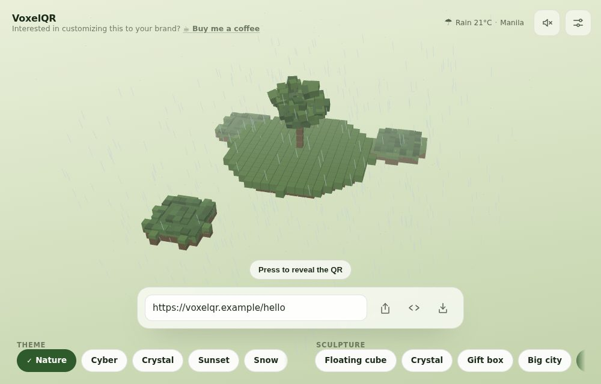 | 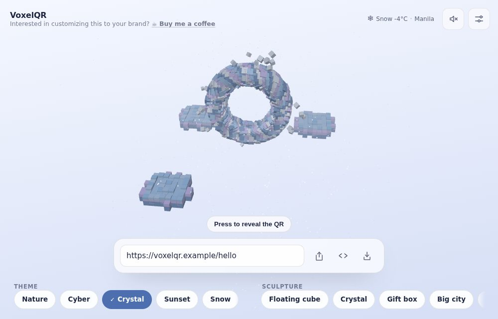 | 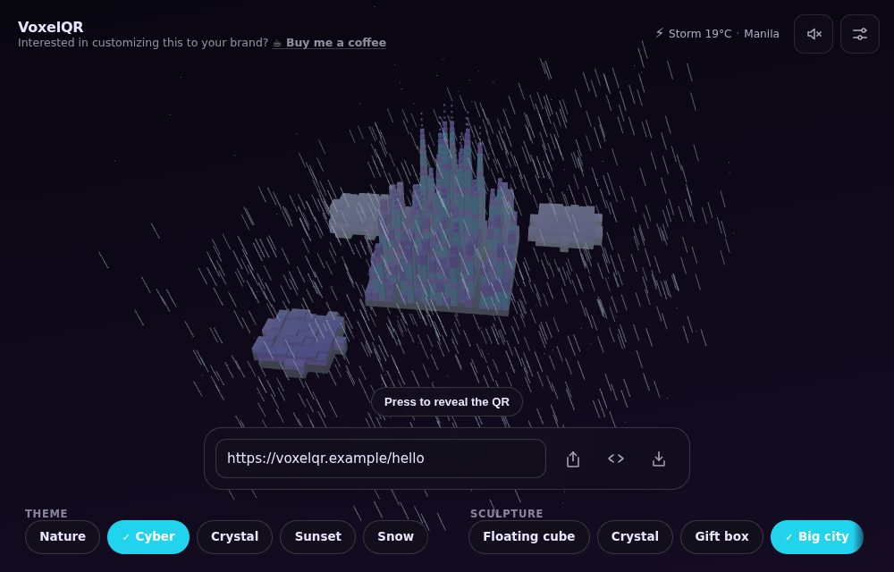 |

Two constraints shaped this.

**No permission prompt.** Location comes from the browser's time zone, which
resolves to a reference city via the public-domain IANA database. A widget
embedded in someone else's blog cannot reasonably ask a reader for their
precise position, and would mostly be refused. City-level is also the right
resolution: weather is regional, and the scene only needs rain from snow from
clear. A time zone that names an offset rather than a place — `UTC`,
`Etc/GMT+5`, what servers and hardened browsers report — yields no weather at
all, because guessing a position from an offset would put the viewer in the
ocean and show them its weather.

**Never load-bearing.** Every failure path — offline, blocked by a host's CSP,
an unknown time zone, a slow network, a garbled response — resolves to nothing
and the scene renders exactly as it would have. Weather is decoration on top of
a QR code, and the QR code is the product: the falling layer fades out entirely
before the code locks, so a raindrop is never drawn over a module, and the e2e
suite decodes the code under a storm, under heavy snow, and in fog at night.

Conditions come from [Open-Meteo](https://open-meteo.com) — no API key, no
account, so the feature costs no secret to store and no user to register. The
readout in the corner names what was applied and discloses the lookup.

---

## Performance

The scene is drawn in ≤5 draw calls (two `InstancedMesh`es for every cube — the
finder squares can be a different shape from everything else, and one mesh has
one geometry — plus the base plane and one particle cloud), no allocation
happens inside the frame loop,
and while the scene is idle the per-instance loop is skipped entirely — the
idle animation is carried by a single group transform, so a resting embed costs
almost no CPU. Rendering pauses when the tab is hidden or the iframe is
scrolled away. Payload: ~127 KB gzipped before the 3D chunk, ~238 KB more for
Three.js loaded lazily behind the first paint — comparable to one hero image,
and cached after the first view.

## Deployment

Static output in `dist/`. `vercel.json` and `public/_headers` carry matching
security headers for Vercel and Cloudflare Pages respectively; any static host
works as long as the headers come with it.

---

## Development notes

Three.js guidance was used while building this (scene and instancing
discipline). It is a development reference, not a runtime dependency. Three.js
DevTools MCP is optional tooling for inspecting a live scene; the deployed
product does not depend on it.

The reveal runs on a small timeline of its own (`src/animation/timeline.ts`)
rather than an animation library. It needs one thing from one — a paused,
reversible sequence of eased tweens over a plain object that lands on its end
values exactly — and that is a hundred lines. Writing them keeps every
dependency this project ships under a licence compatible with its own.

The images in this README are generated, not hand-picked: `npm run media`
captures them from the running app through the same Playwright harness the
tests use, so a README picture cannot drift from what the product does. It is
opt-in, so an ordinary test run never writes into the working tree.

The two interaction cues and the per-theme ambient bed are synthesised at
runtime with the Web Audio API. Under them sits one licensed lofi track per
theme, credited in [ATTRIBUTION.md](ATTRIBUTION.md) and on the sound control
itself. Everything starts muted, and only the current theme's track is fetched,
only once someone turns the sound on — so a visitor who never unmutes downloads
none of it.

---

## Support

VoxelQR is free and open source, and built in spare hours. If it is useful to
you — or you want it in your own brand's colours, sculpture and palette — the
same link does both:

**[☕ Buy me a coffee](https://buymeacoffee.com/lewisjohnvil)**

Commission enquiries are welcome through the message form there.

---

## Credits

Created by **Lewis John Villamor** — [buymeacoffee.com/lewisjohnvil](https://buymeacoffee.com/lewisjohnvil).

All branding, interface design, animation, sound, 3D content and source code in
this project are original. Third-party assets are limited to the music and the
weather data, both credited in [ATTRIBUTION.md](ATTRIBUTION.md).

Licensed under the **GNU General Public License v3.0** — see [LICENSE](LICENSE).
The licence covers the source; the music and weather data carry their own terms,
recorded in [ATTRIBUTION.md](ATTRIBUTION.md).
