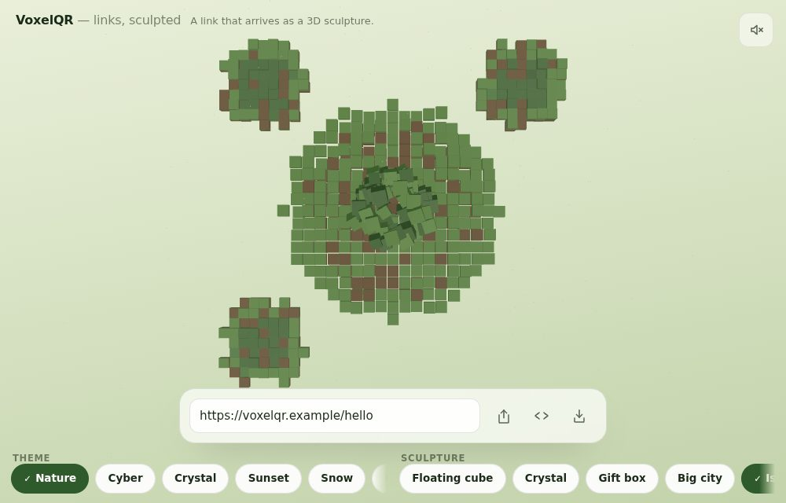
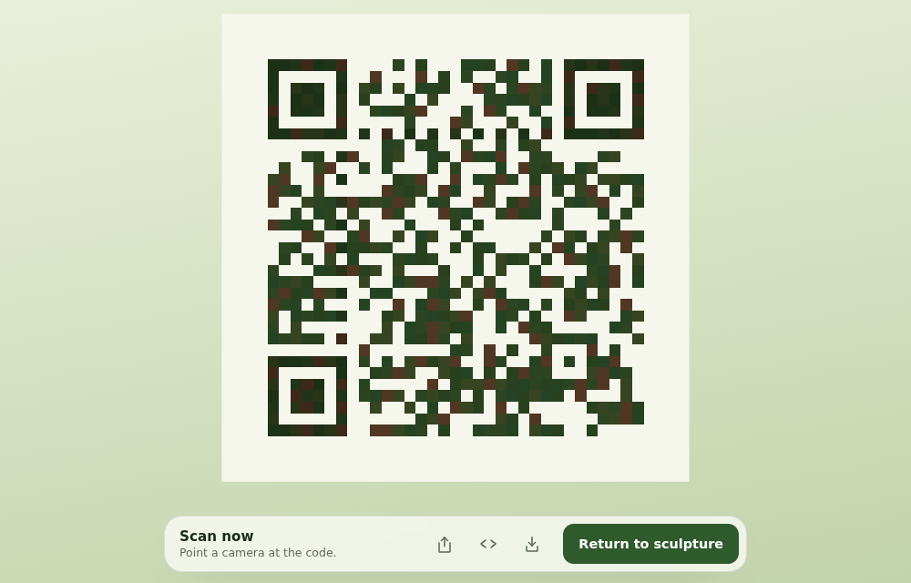
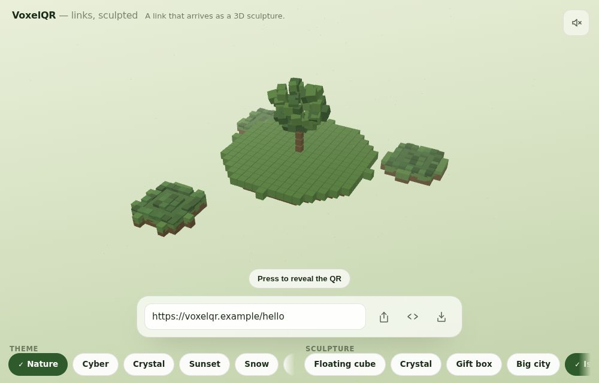
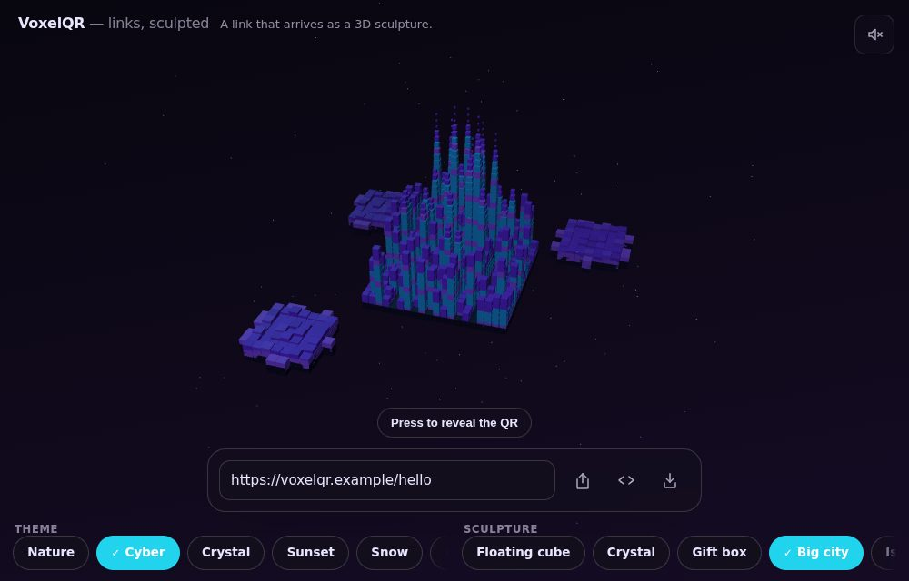
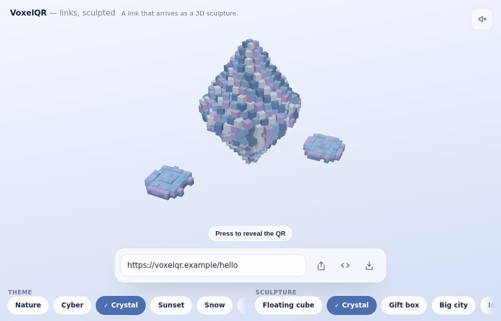
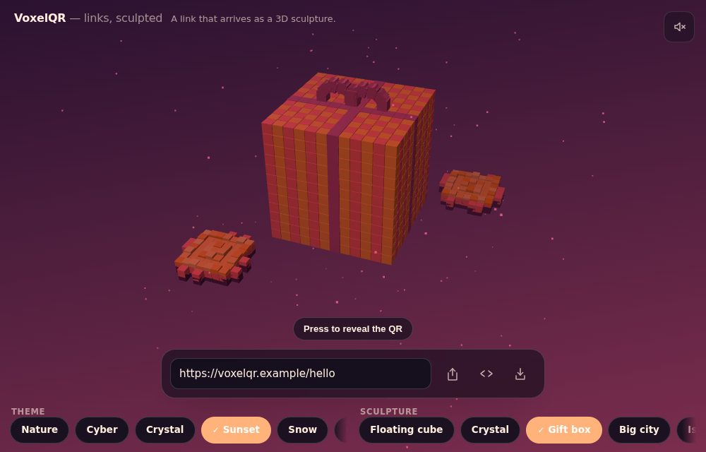
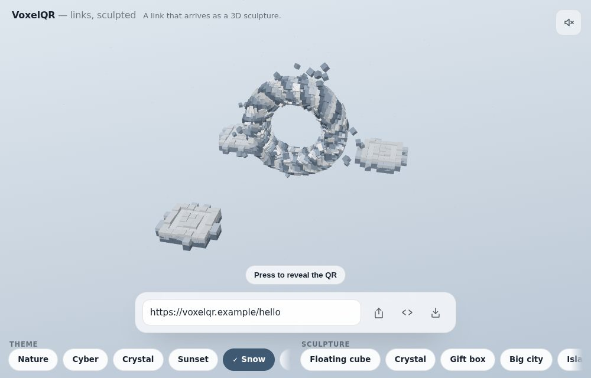
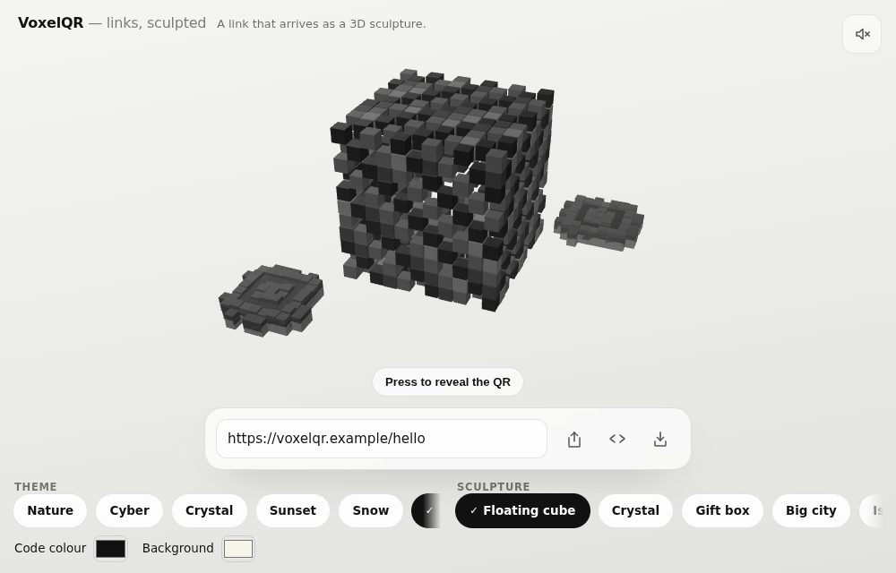
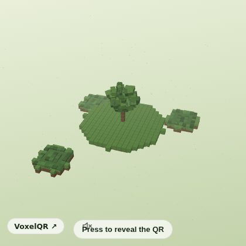
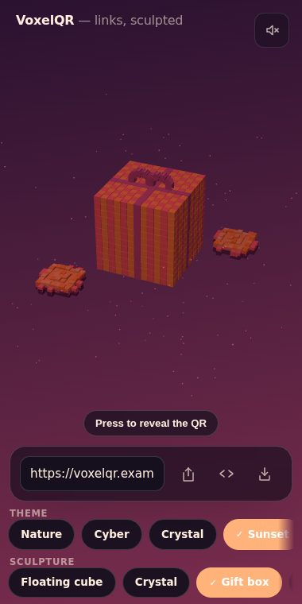

# VoxelQR

**Turn any link into a living 3D voxel sculpture that transforms into a QR code.**

By **Lewis John Villamor**


VoxelQR renders a link as a voxel sculpture with three small voxel plots
resting around it — the finder squares, grounded in scenery built from the same
palette. No platform, no visible code.

Six sculptures ship: a floating cube, a crystal, a gift box, a downtown city
skyline, an island with a tree, and an abstract portal. Press the sculpture and the
camera tilts to a perfect top-down view while the code grows out of the ground
and the sculpture is absorbed into it. Press **Return to sculpture** and the
same timeline runs backwards.

Everything happens in the browser. There is no backend, no database, no account,
and the destination link is never sent anywhere.

## The transformation

| Sculpture                                                 | Mid-reveal                                                              | Scan-ready                                                    |
| --------------------------------------------------------- | ----------------------------------------------------------------------- | ------------------------------------------------------------- |
|  |  |  |

The scan-ready image above is a real, working code — it decodes to
`https://voxelqr.example/hello`, and the test suite decodes that exact file.

## Sculptures and themes

|                                                                 |                                                                      |                                                                    |
| --------------------------------------------------------------- | -------------------------------------------------------------------- | ------------------------------------------------------------------ |
|  |         |         |
| **Island** · Nature                                             | **Big city** · Cyber                                                 | **Crystal** · Crystal                                              |
|  |  |  |
| **Gift box** · Sunset                                           | **Abstract portal** · Snow                                           | **Floating cube** · Brand                                          |

Every layout is seeded from the destination URL, so the same link always
produces the same sculpture.

## Anywhere it needs to go

| Embeddable widget                                        | On a phone                                  |
| -------------------------------------------------------- | ------------------------------------------- |
|  |  |

---

## Quick start

```bash
npm install
npm run dev        # http://localhost:5173
```

| Script                            | What it does                                            |
| --------------------------------- | ------------------------------------------------------- |
| `npm run dev`                     | Dev server with the production CSP applied              |
| `npm run build`                   | Typecheck and build to `dist/`                          |
| `npm run preview`                 | Serve `dist/` on port 4173                              |
| `npm test`                        | Unit and component tests (Vitest)                       |
| `npm run test:e2e`                | Browser tests, including the ZXing decode matrix        |
| `npm run media`                   | Regenerate the README screenshots from the running app  |
| `npm run lint` / `npm run format` | ESLint / Prettier                                       |
| `npm run verify`                  | Format check, lint, unit tests and build — what CI runs |

The end-to-end suite builds nothing itself; run `npm run build` first, or let the
Playwright web server do it via `npm run preview`.

---

## How it works

```
React UI  ──►  experience store (validated state)
                 │
                 ├──►  src/qr/        normalize-url → generate-matrix (boolean module matrix)
                 ├──►  src/sharing/   zod schema → base64url codec (?experience=)
                 └──►  src/themes/    palette + contrast guarantee
                          │
              src/voxel/  build-qr-layout + build-sculpture-layout → VoxelInstance[]
                          │
          src/animation/  one reversible GSAP master timeline → progress 0..1
                          │
   src/components/scene/  InstancedMesh (one draw call) + scan-safe backing plane
```

Each module owns one thing. The QR engine does not know what a voxel is; the
scene renders but never holds application state; GSAP animates but never
validates a URL. Nothing calls `setState` during the animation loop — the frame
loop writes matrices into a single `InstancedMesh`.

### Why the code actually scans

Rendering a QR out of cubes is the entire product and the entire risk, so
reliability is enforced in three places rather than hoped for:

1. **Exact lock geometry.** At the end of the timeline the camera looks straight
   down −Z, the QR plane sits frontally at z = 0, rotations are zero and module
   spacing is exactly one world unit. A frontal flat plane under a perspective
   camera has no projection error.
2. **A canonical backing layer.** A nearest-filtered `CanvasTexture` carrying the
   mathematically exact code — quiet zone included — sits just behind the voxels
   in the same colours, so anti-aliased cube edges land on correct pixels.
3. **A shader-level flat lock.** At the lock stage the lit result is replaced by
   the raw instance colour, so lighting, fog and shadows cannot tint a module.

On top of that, `toScanSafePair` guarantees at least a 7:1 contrast ratio with
the darker colour as the foreground, for every theme and for any brand colours a
user picks.

And it is a build gate: `tests/e2e/qr-decode.spec.ts` screenshots the live WebGL
canvas in its scan-ready state and decodes it with ZXing across six viewports and
pixel densities, all six themes, all six sculptures, short and long URLs, and
reduced-motion mode. A code that will not decode fails CI.

### Scanning headroom, measured

"It decodes" is a weak test — it says nothing about how much room the code has
before it stops working. `tests/e2e/degrade.ts` shrinks a capture and re-decodes
it, which stands in for scanning from further away or with a poorer sensor, and
reports the smallest fraction that still reads.

That measurement changed the design. Error correction was fixed at level `H`,
following the spec's advice — but `H` is protection against a code being
_obscured_, and nothing obscures this one: the sculpture is fully absorbed and
the scan plane is clean. What actually limits scanning is how many screen pixels
each module gets, and `H` was spending 30% more modules to buy redundancy the
design never needed:

| Link      |  Level `H` |         Adaptive |  Headroom before | Headroom after |
| --------- | ---------: | ---------------: | ---------------: | -------------: |
| 29 chars  | 33 modules | 33 modules (`H`) |   decodes at 10% | decodes at 10% |
| 72 chars  | 49 modules | 41 modules (`Q`) |                — |              — |
| 173 chars | 69 modules | 53 modules (`M`) | **only at 100%** | decodes at 15% |

`chooseErrorCorrectionLevel` now takes the strongest level whose code still fits
a module budget, never dropping below `M` (15% recovery, the usual print
default). Short links keep `H` and lose nothing; the long link gained roughly
6.7x more scanning distance. `tests/e2e/scan-margin.spec.ts` locks that in — pin
the level back to `H` and it fails.

The same measurement drove two more decisions. The mosaic's contrast floors were
raised from 5:1 and 6.5:1 to **7:1 and 9:1** — 5:1 is comfortable for text and
thin for a QR module, and a lightly-tinted module on a glare-lit screen is
exactly the one a binarizer misreads. And the 2D fallback drops the mosaic
entirely for the solid contrast-guaranteed pair (**15:1 or better** on every
theme): it renders where WebGL could not, on the weakest devices and often the
poorest screens, so decoration is the wrong trade. It decodes down to 25% of
capture size, guarded by its own test.

---

## Sculptures and themes

Six procedural sculptures — floating cube, crystal, gift box, miniature city,
island, abstract portal — and six themes — Nature, Cyber, Crystal, Sunset, Snow
and Brand (your own two colours). All layouts are seeded from the destination
URL, so the same link always produces the same sculpture.

---

## Sharing

**A share link carries the whole 3D experience, not a picture of a code.** The
payload holds the destination plus the sculpture, theme and any brand colours,
so whoever opens it lands on the same sculpture and presses it themselves. If
you want a flat image instead, that is what **Save image** is for.

| Action         | What the recipient gets                                                 |
| -------------- | ----------------------------------------------------------------------- |
| **Share**      | A link to the live 3D experience, restored exactly as you configured it |
| **Embed**      | An `<iframe>` snippet putting that same live experience in your page    |
| **Save image** | A PNG — the sculpture, or a scannable code, for email and print         |

The current destination and appearance are encoded into the address bar as a
versioned, Base64URL-encoded JSON payload under `?experience=`, parsed with Zod on
the way back in. Unknown fields are ignored, invalid sculptures and themes fall
back to defaults, and an oversized or manipulated payload loads the default
experience instead of breaking the page.

**Share links contain the destination URL in plain sight.** It is encoded, not
encrypted, and the interface says so.

---

## Accessibility

Nothing requires touching the canvas _in the sense that matters_: the reveal
gesture is pressing the sculpture, but that target is a real `<button>` with an
accessible name, reachable by keyboard and announced by screen readers — the
gesture is the styling, not the mechanism. The icon actions (share, embed, save)
carry `aria-label` and a hover tooltip, so nothing depends on recognising a
glyph; the sculpture and theme pickers are arrow-key radio groups; and URL
errors and the scan-ready state are announced through a polite live region.
State is never signalled by colour alone.
With `prefers-reduced-motion` the scatter choreography is replaced by a short
interpolation and idle rotation stops, with no loss of function.

---

## Using it in email

Email clients strip scripts, iframes and WebGL, so the live widget cannot run
inside an inbox — nothing interactive can. What works everywhere is an image:

1. Configure the experience and press **Save image** — in the scan-ready state
   the export is named `voxelqr-code.png` and is itself a scannable QR (the e2e
   suite decodes the actual downloaded file).
2. Put that image in the email and link it to your share URL, so a click opens
   the full 3D experience in the browser while a phone camera can scan the
   picture directly from the screen.

The sculpture-state export (`voxelqr-<sculpture>-<theme>.png`) makes a good
hero image for the same link.

## Performance

One `InstancedMesh` draws every cube. No vectors, matrices or colours are
allocated inside the frame loop. Rendering stops entirely when the tab is hidden,
and the device pixel ratio is capped by the active quality tier:

| Tier     | Cubes | Shadows | Particles |      Max DPR |
| -------- | ----: | ------- | --------: | -----------: |
| High     |  1400 | yes     |       260 |            2 |
| Medium   |   900 | no      |       120 |         1.75 |
| Low      |   520 | no      |         0 |          1.5 |
| Fallback |     — | —       |         — | 2D canvas QR |

---

## Security and privacy

QR generation is local, only `http:` and `https:` destinations are accepted (up
to 1,200 characters), unsafe schemes are rejected on entry _and_ again when a
share link is decoded, and the app never navigates to a user-entered URL. No
analytics, no third-party requests: an end-to-end test asserts that nothing ever
leaves the app's own origin. A restrictive CSP ships with the dev server, the
preview server, `public/_headers` and `vercel.json`.

---

## Embedding in a website or blog

The whole product works as a widget. Press **Embed** in the app to copy a
ready-to-paste snippet, or write it by hand:

```html
<iframe
  src="https://your-host.example/?experience=<payload>&embed=1"
  width="420"
  height="420"
  style="border: 0; border-radius: 16px; overflow: hidden"
  loading="lazy"
  title="VoxelQR — a link as a 3D sculpture that becomes a QR code"
></iframe>
```

`embed=1` strips the chrome: just the sculpture on its code, a reveal button
and a small attribution link back to the full experience. The CSP allows
framing by design (the app is stateless and cookieless, so there is nothing to
clickjack), `loading="lazy"` defers the download until the reader scrolls near,
and the scene stops rendering entirely whenever the iframe is off-screen or the
tab is hidden — an embed below the fold costs nothing.

## Using it in email

Email clients strip scripts, iframes and WebGL, so the live widget cannot run
inside an inbox — nothing interactive can. What works everywhere is an image:

1. Configure the experience and press **Save image** — in the scan-ready state
   the export is named `voxelqr-code.png` and is itself a scannable QR (the e2e
   suite decodes the actual downloaded file).
2. Put that image in the email and link it to your share URL, so a click opens
   the full 3D experience in the browser while a phone camera can scan the
   picture directly from the screen.

The sculpture-state export (`voxelqr-<sculpture>-<theme>.png`) makes a good
hero image for the same link.

## Performance

The scene is drawn in ≤4 draw calls (one `InstancedMesh` for every cube, the
base plane, one particle cloud), no allocation happens inside the frame loop,
and while the scene is idle the per-instance loop is skipped entirely — the
idle animation is carried by a single group transform, so a resting embed costs
almost no CPU. Rendering pauses when the tab is hidden or the iframe is
scrolled away. Payload: ~127 KB gzipped before the 3D chunk, ~238 KB more for
Three.js loaded lazily behind the first paint — comparable to one hero image,
and cached after the first view.

## Deployment

Static output in `dist/`. `vercel.json` and `public/_headers` carry matching
security headers for Vercel and Cloudflare Pages respectively; any static host
works as long as the headers come with it.

---

## Development notes

Three.js and GSAP guidance were used while building this (scene and instancing
discipline, timeline and cleanup practice). They are development references, not
runtime dependencies. Three.js DevTools MCP is optional tooling for inspecting a
live scene; the deployed product does not depend on it.

The images in this README are generated, not hand-picked: `npm run media`
captures them from the running app through the same Playwright harness the
tests use, so a README picture cannot drift from what the product does. It is
opt-in, so an ordinary test run never writes into the working tree.

The images in this README are generated, not hand-picked: `tests/e2e` captures
them from the running app, so they cannot drift from what the product actually
looks like.

This product contains no third-party branding, assets, audio or source code. The
sound — two cues plus a looping ambient bed per theme — is synthesised at
runtime with the Web Audio API, and starts muted until the user turns it on.

---

## Credits

Created by **Lewis John Villamor**.

Interaction pattern inspired by ICQR's Magic Tree. All branding, interface
design, animation, sound, 3D content and source code in this project are
original — no ICQR assets or code are used. Licensed under the MIT License; see
[LICENSE](LICENSE).
